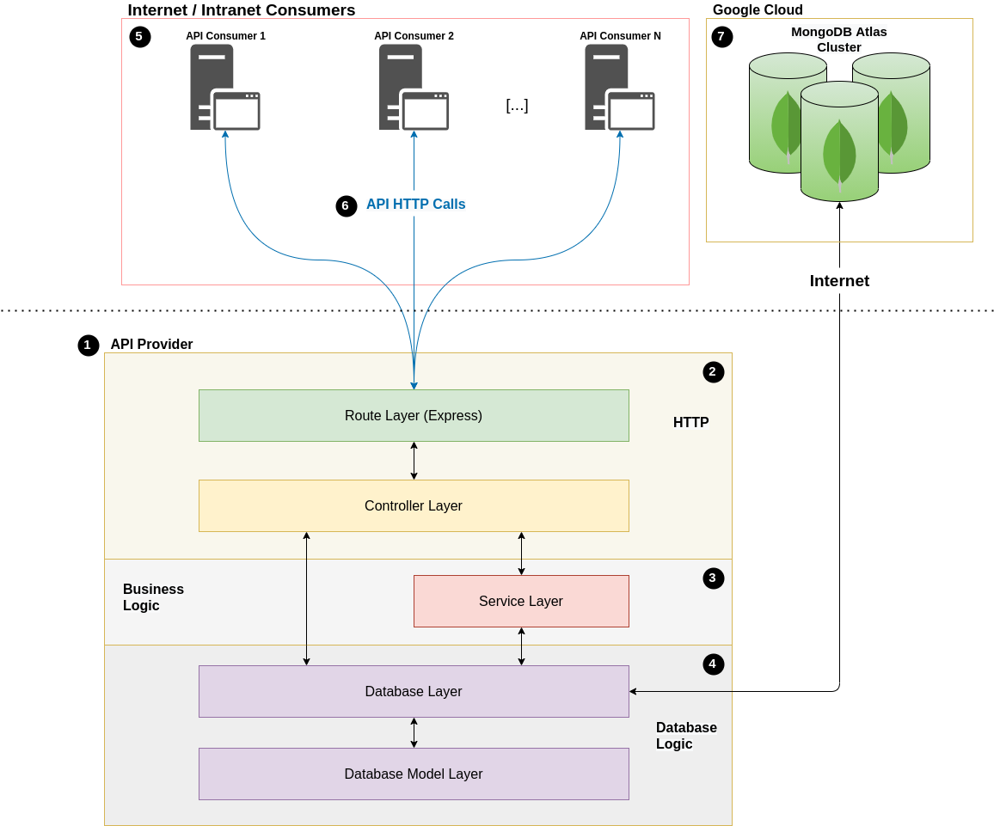
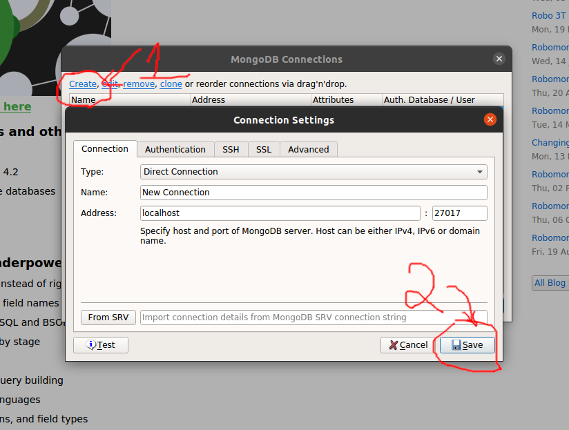
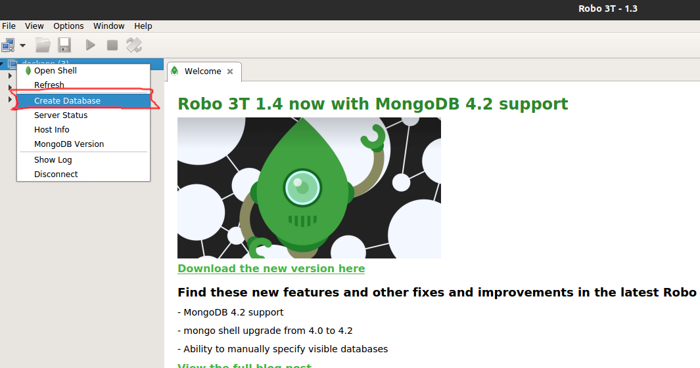
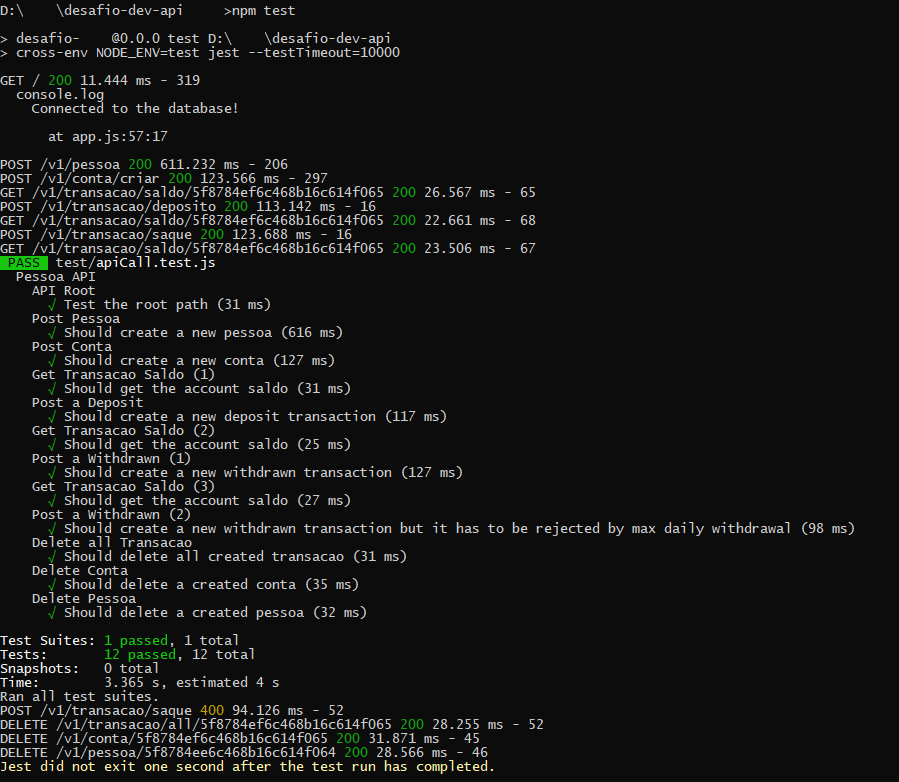
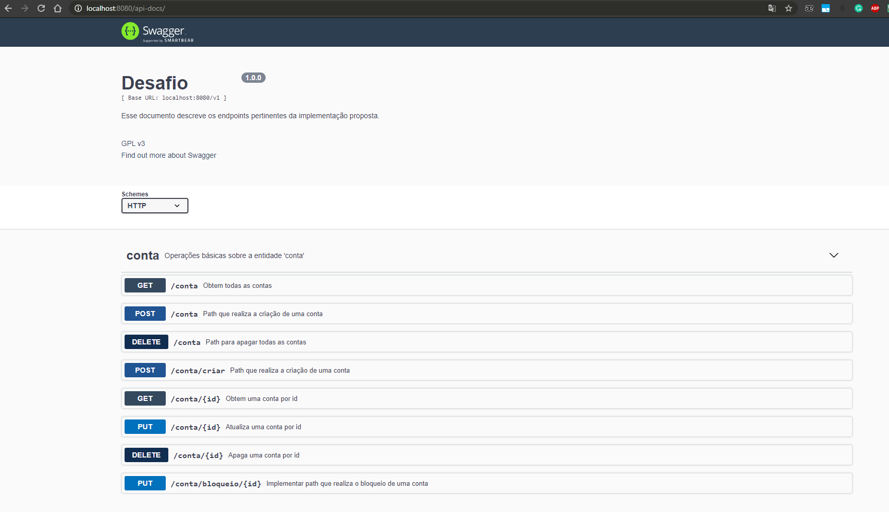
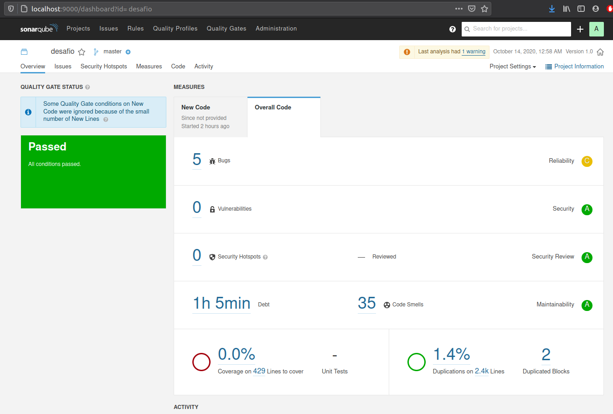

# Gestão de Contas

Esse documento descreve o sistema de gestão de contas (backend), proposto para um desafio de programação em 2020. Lembrando que os a documentação descreverá a arquitetura básica, o processo de instalação dos softwares e links como referência, que estenderá o entendimento da aplicação backend.

&nbsp;
&nbsp;
&nbsp;
&nbsp;

## Arquitetura

#### Visão geral do sistema
O objetivo desse tópico é apresentar as partes principais da arquitetura MVC adaptada, utilizando a lib Express.JS / Node.JS, como é observado na figura abaixo.

Foram adicionados números, linhas e caixas para facilitar a localização da parte que está sendo descrita. Assim, os números adicionados na figura correspondem com os números da lista de tópicos numéricos logo abaixo.

&nbsp;
&nbsp;



&nbsp;
&nbsp;

1) O software em si, chamado aqui de **API Provider**, possui as camadas de comunicação HTTP, Bussiness Logic e Database Logic;
2) A camada de comunicação **HTTP** é composta por subcamadas de rotas do framework Express.JS e os controladores. Uma rota tem a finalidade de mapear o path HTTP para uma função do controlador, que define como vai funcionar e quais regras de negócio serão aplicadas no endpoint;
3) A camada de **Business Logic** é responsável por operações lógicas mais complexas, utilizado nas operações de saque e depósito em uma conta, por exemplo;
4) A camada de **Database Logic** possui os modelos, conexão e todas as operações relativas ao banco de dados que suportam a aplicação backend;
5) Os **Consumers** foi o nome dado para as aplicações externas que utilizam a API proposta;
6) As chamadas para a API (**chamas HTTP / API RESTful**), realizadas por consumidores para os endpoints;
7) Com objetivo de facilitar a rápida execução da API, foi escolhido o serviço MongoDB Atlas Database - Cloud DBaaS for MongoDB. A instalação da arquitetura do banco de dados foi realizada em um cluster de três máquinas em replica set. Existe a possibilidade da instalação local do banco MongoDB e também, será descrita a seguir (**Servidores desativados, por favor utilizar a versão de instalação local do MongoDB**).
  
#### Requisitos não funcionais

- Sistemas operacionais requeridos e testados: Windows 10 e Ubuntu 20.04;
- Conexão com a Internet.

**OBS.:** A conexão com a Internet somente é necessária caso opte por utilizar o servidor MongoDB disponível na Cloud.

#### O que não foi observado na API

Por ser um sistema com caráter de avaliação, não foram observadas as seguintes situações, que normalmente não são deixados de lado em produção:

- O timezone da máquina host, API e Banco de Dados trabalham no formato UTC somente, o que poderia ocasionar algum mal entendido nos consumidores da API, como *'queries'* que utilizam data e hora em horário local.
- Tradução para o inglês das entidades propostas (conta, transação e pessoa);
- Testes unitários, mas foram criados alguns testes de integração;
- Conserto de bugs encontradas em ferramentas de análise de código estático;
- Separação em ambiente de produção, desenvolvimento e teste;
- Autenticação e autorização, que deve ser observado em um sistema de produção, como a utilização do protocolo OAuth2;
- Encriptação de canal de comunicação HTTP.

## Configuração do ambiente e manual de execução

#### Hardware Utilizados
- Computador PC comum.

#### Softwares Utilizados
- IDE Visual Studio Code na última versão disponível *;
- Banco de dados MongoDB versão 4.2.10 ou superior;
- NodeJS versão 10 ou 12;
- Robo 3T na última versão disponível;
- Postman na última versão disponível;
- GIT na última versão disponível.

\* A IDE Visual Studio code não será necessária para executar a API.

#### Instalação do ambiente

1) O download do NodeJS pode ser efetuado por meio deste [link](https://nodejs.org/pt-br/download/). O processo de instalação pelo Windows é um simples instalador estilo *'Next, Next... and Finish'*. Mais detalhes de como instalar em outros sistemas operacionais, consulte o link de [documentação](https://nodejs.org/en/download/package-manager/).

2) O download e instalação do banco de dados devem ser local. Existia um banco na cloud para testar essa aplicação, mas ele foi desativado. Então, recomenda-se a instalação local do MongoDB. O download do MongoDB pode ser realizado no [link](https://www.mongodb.com/try/download/community), que possui um processo de instalação simples e pode ser verificado [aqui](https://medium.com/@LondonAppBrewery/how-to-download-install-mongodb-on-windows-4ee4b3493514). Mais detalhes de como instalar em outros sistemas operacionais, consulte o link da [documentação](https://docs.mongodb.com/guides/server/install/). Lembrando que é necessário modificar o arquivo *'${project_path}/resources/appConstants.js'* com a URL correta da conexão do banco local, por exemplo:
```
De:
mongodbUrl: 'mongodb+srv://sa:AcessoApp@@cluster0.6oyki.gcp.mongodb.net/app?retryWrites=true&w=majority'
Para (sem senha):
mongodbUrl: 'mongodb://localhost/app?retryWrites=true&w=majority'
```

3) O software Robo 3T é uma ferramenta gráfica de acesso ao MongoDB, possibilitando executar comandos e verificar os dados da aplicação. Essa ferramenta é opcional, caso queira visualizar os documentos da aplicação diretamente no banco de dados. Para instalar, clique [aqui](https://download.studio3t.com/robomongo/windows/robo3t-1.4.1-windows-x86_64-122dbd9.exe) ou visite a [página](https://robomongo.org/download) e realize o download do programa *'Robo 3T: Simple GUI for beginners'*. Os passos de instalações para Windows são simples, contando com o bom e velho *'Next, Next... and Finish'*. A instalação para Ubuntu 20.04 é feita através da Ubuntu Software, procurando pela palavra chave *'Robo 3T'*.


**OBS.:** Caso opte pela instalação do banco local, os seguintes passos são necessários para criação do Database chamado *app*, ou para visualizar os dados diretamente no banco em qualquer *collection*, seja na cloud ou local.
	a) Configuração do Robo 3T local, siga as configurações das marcações realizadas nas figuras abaixo:
	&nbsp;
	
	&nbsp;
	Crie o database chamado *'app'*, após conecta-se no MongoDB:
	&nbsp;
	
	&nbsp;
	&nbsp;
	b) Configuração remota (Google Cloud): siga os passos do guia no [link](https://nisorness.com/data/2017/7/26/how-to-connect-to-mongodb-atlas-using-robo-3t-robomongo) e utilize as seguintes configurações de acesso:

Type:
```
Replica Set
```
Replicaset Members:
```
Desativado! Porém, pode-se utlizar o serviço MongoDB Atlas aqui!
```
User Name:
```
sa
```
Password:
```
AcessoApp@
```


4) O software Postman pode ser obtido diretamente nesta [página](https://www.postman.com/downloads/) e conta com a instalação *'Next, Next... and Finish'*. Já  a instalação para Ubuntu 20.04 é feita através da Ubuntu Software, procurando pela palavra chave *'Postman'*. Pode-se importar o seguinte [set de consultas](./docs/collection.postman_collection.json) para ajudar na execução de chamadas na API.

5) O software Git pode ser obtido diretamente nesta [página](https://git-scm.com/downloads) e conta com a instalação *'Next, Next... and Finish'*. Já  a instalação para Ubuntu 20.04 é feita através do Terminal, executando o comando *'sudo apt-get install git'*.

#### Passos para execução do ambiente

1) Realizar o clone do projeto no terminal:

	```
	git clone https://github.com/joelravelli/gestao-de-contas.git
	```

2) Acesso o diretório:
	```
	cd gestao-de-contas
	```

3) Double check para ter certeza de que está na branch correta:
	```
	git checkout main
	```

4) Verificar se existe o comando npm instalado:
	```
	npm --version
	```

5) Instale os módulos da aplicação:
	```
	npm install
	```

6) Nesse ponto, temos dois comandos possíveis, executar o procedimento de teste ou iniciar a aplicação como serviço:

	a) Executar o teste da API, com o comando:
	```
	npm test
	```
	A seguinte saída deve ser apresentada:
	&nbsp;
	
	&nbsp;
	&nbsp;

	b) Executar a aplicação como serviço:
	```
	npm start
	```
  
## Documentação da API
O acesso para a documentação da API estará disponível na [página root da aplicação](http://localhost:8080) ao clicar no link *'Link para a documentação da API'*, depois de realizado todos os passos da seção de *'Configuração do ambiente e manual de execução'* e executar o passo 6b. Tela da documentação online da API:


  
A API possui vários endpoints que não estavam na proposta inicial desse desafio, porém foram criados endpoints extras para apoiar o teste de integração, adicionar a função de criação de uma *'pessoa'* e apoiar os meus próprios testes. Para facilitar, vou descrever as implementações dos *'paths'* requeridos e como foram implementados, de acordo com a tabela abaixo:

|Operação na tabela|Descrição do endpoint original | Path implementado         |
|----------------|-------------------------------|-----------------------------|
|conta|realiza a criação de uma conta |/v1/conta/criar           |
|conta|realiza o bloqueio de uma conta|/v1/conta/bloqueio/{idConta}|
|transacao|realiza operação de depósito em uma conta |/v1/transacao/deposito|
|transacao|realiza operação de consulta de saldo em determinada conta|/v1/transacao/saldo/{idConta}|
|transacao|realiza operação de saque em uma conta|/v1/transacao/saque|
|transacao|recupera o extrato de transações de uma conta|/v1/transacao/extrato/{idConta}|
|transacao|implementar extrato por período|/v1/transacao/extrato/{idConta}|
|pessoa|enviar script de criação de, pelo menos, uma pessoa*|/v1/pessoa|

&nbsp;

**OBS:.** Utilizar a seguinte formação para datas nos endpoints que necessitam: {"startDate": "2020-10-10T03:24:00"}.

&nbsp;

## Análise estática de código
A ideia inicial era disponibilizar um relatório completo da análise estática de código feito pela ferramenta [Sonarqube](https://www.sonarqube.org/). Porém, a ferramenta não exporta um relatório (somente versão comercial) e assim, anexar ao projeto. Então, inseri uma captura de tela dos resultados gerais da análise abaixo.

&nbsp;



&nbsp;

Documento produzido por Joel Ravelli Junior com auxílio da ferramenta [Stackedit.io](https://stackedit.io/app).
